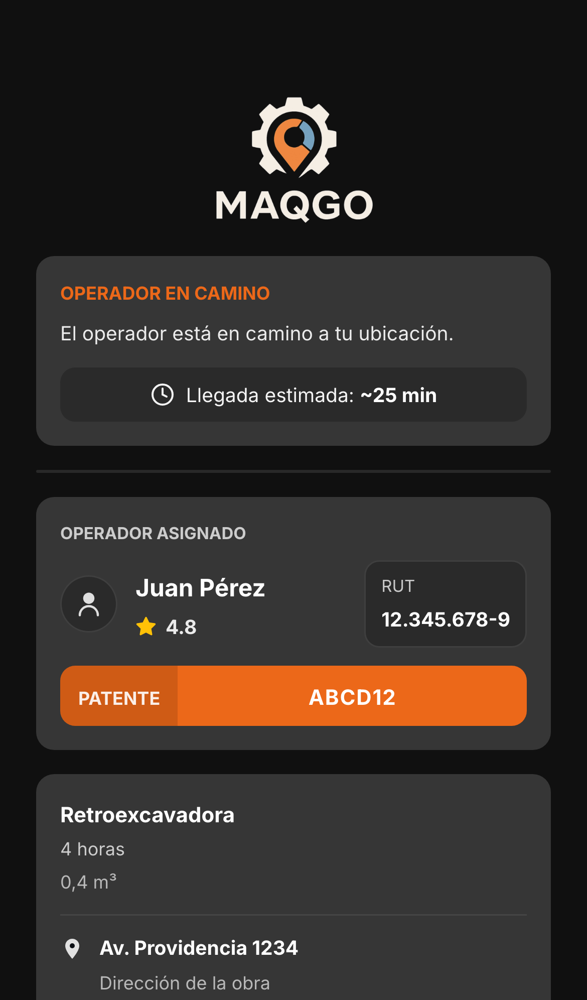
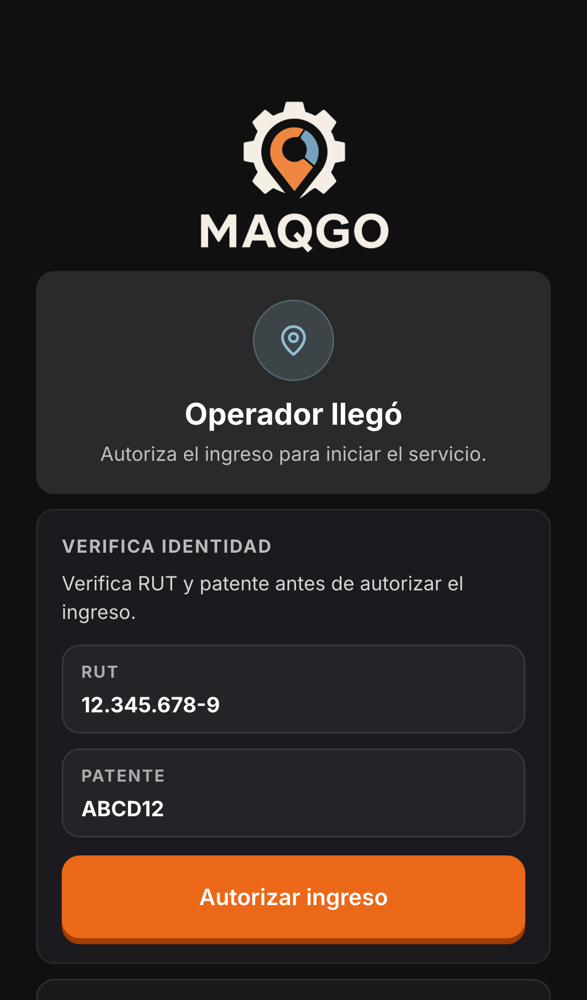
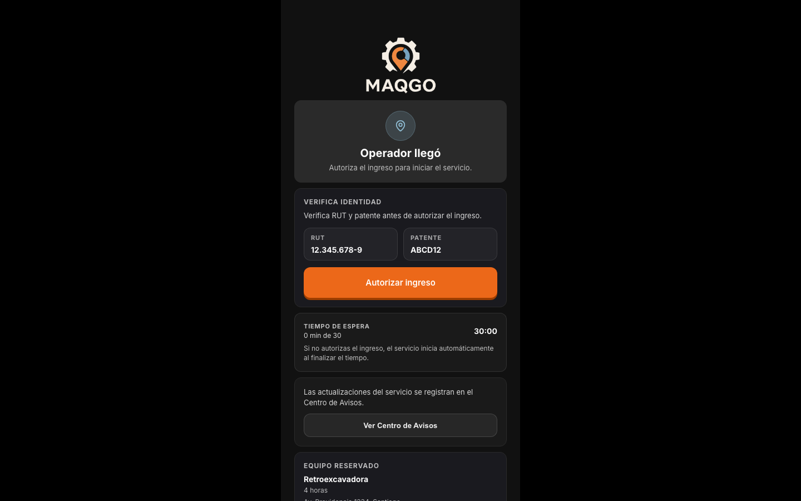

# EN_ROUTE_AND_ARRIVED_VISUAL_AUDIT

## /client/en-route — ClientEnRouteScreen

### 1) Captura completa Mobile

### 2) Captura completa Desktop

### 3) Inventario visual
- Hero: “Operador en camino” + texto “El operador está en camino a tu ubicación.” + bloque “Llegada estimada ~XX min” ([ClientEnRouteScreen.js:L153-L179](file:///Users/tomasvillalta/Desktop/Repositorios%20Github/Maqgo%20Principal/Maqgo/frontend/src/screens/client/ClientEnRouteScreen.js#L153-L179))
- Cards:
  - Card operador (nombre + rating) + bloque RUT + bloque Patente ([ClientEnRouteScreen.js:L197-L265](file:///Users/tomasvillalta/Desktop/Repositorios%20Github/Maqgo%20Principal/Maqgo/frontend/src/screens/client/ClientEnRouteScreen.js#L197-L265))
  - Card resumen (maquinaria + duración + ubicación) ([ClientEnRouteScreen.js:L267-L294](file:///Users/tomasvillalta/Desktop/Repositorios%20Github/Maqgo%20Principal/Maqgo/frontend/src/screens/client/ClientEnRouteScreen.js#L267-L294))
- CTA: no hay CTA principal/acciones visibles (no se renderizan botones en esta pantalla)
- Mapa: `OnTheWayMap` (ubicación operador + ubicación obra) ([ClientEnRouteScreen.js:L182-L195](file:///Users/tomasvillalta/Desktop/Repositorios%20Github/Maqgo%20Principal/Maqgo/frontend/src/screens/client/ClientEnRouteScreen.js#L182-L195))
- ETA: visible en hero (pill “Llegada estimada ~XX min”) ([ClientEnRouteScreen.js:L160-L179](file:///Users/tomasvillalta/Desktop/Repositorios%20Github/Maqgo%20Principal/Maqgo/frontend/src/screens/client/ClientEnRouteScreen.js#L160-L179))
- Datos operador: nombre + rating ([ClientEnRouteScreen.js:L229-L236](file:///Users/tomasvillalta/Desktop/Repositorios%20Github/Maqgo%20Principal/Maqgo/frontend/src/screens/client/ClientEnRouteScreen.js#L229-L236))
- RUT: bloque “RUT” ([ClientEnRouteScreen.js:L248-L252](file:///Users/tomasvillalta/Desktop/Repositorios%20Github/Maqgo%20Principal/Maqgo/frontend/src/screens/client/ClientEnRouteScreen.js#L248-L252))
- Patente: bloque “Patente” ([ClientEnRouteScreen.js:L255-L264](file:///Users/tomasvillalta/Desktop/Repositorios%20Github/Maqgo%20Principal/Maqgo/frontend/src/screens/client/ClientEnRouteScreen.js#L255-L264))
- Footer: no se muestra en esta ruta (no está en `mainPathsWithNav`) ([App.jsx:L230-L239](file:///Users/tomasvillalta/Desktop/Repositorios%20Github/Maqgo%20Principal/Maqgo/frontend/src/App.jsx#L230-L239))
- Otros bloques visibles (condicionales):
  - Banner “El operador está llegando / Prepárate para recibirlo” (`showNearbyBanner`) ([ClientEnRouteScreen.js:L295-L338](file:///Users/tomasvillalta/Desktop/Repositorios%20Github/Maqgo%20Principal/Maqgo/frontend/src/screens/client/ClientEnRouteScreen.js#L295-L338))
  - Card “Incidente reportado” (`activeIncident`) ([ClientEnRouteScreen.js:L340-L355](file:///Users/tomasvillalta/Desktop/Repositorios%20Github/Maqgo%20Principal/Maqgo/frontend/src/screens/client/ClientEnRouteScreen.js#L340-L355))

### 4) Valor UX
- **Duplica contenido existente**.
- Evidencia visual: muestra ETA + mapa + datos operador (mismo tipo de bloques de seguimiento que ya existen en el seguimiento por estado en `/client/assigned` (screenshot “en-camino” en el set QA actual) `archive/qa-screenshots/qa-screenshots-history/service-flow-premium-full/en-camino_mobile.png` / `archive/qa-screenshots/qa-screenshots-history/service-flow-premium-full/en-camino_desktop.png`.

### 5) Riesgo de consolidación
- Si “En Camino” se absorbe dentro de “Asignado”, la información que hoy quedaría sin una superficie dedicada equivalente (tal como se ve en esta pantalla) es:
  - Hero dedicado “Operador en camino” + bloque ETA destacado “Llegada estimada ~XX min”.
  - Mapa con ruta/posiciones como bloque central.
  - Card de identidad (nombre/rating + RUT + patente) en esta composición específica.
  - Bloques condicionales visibles: banner “El operador está llegando” y card “Incidente reportado”.

---

## /client/provider-arrived — ProviderArrivedScreen

### 1) Captura completa Mobile

### 2) Captura completa Desktop

### 3) Inventario visual
- Hero: “Operador llegó” + subtítulo “Autoriza el ingreso para iniciar el servicio.” ([ProviderArrivedScreen.js:L196-L219](file:///Users/tomasvillalta/Desktop/Repositorios%20Github/Maqgo%20Principal/Maqgo/frontend/src/screens/client/ProviderArrivedScreen.js#L196-L219))
- Cards:
  - “Verifica identidad” + instrucción + bloques RUT y Patente + CTA “Autorizar ingreso” ([ProviderArrivedScreen.js:L223-L250](file:///Users/tomasvillalta/Desktop/Repositorios%20Github/Maqgo%20Principal/Maqgo/frontend/src/screens/client/ProviderArrivedScreen.js#L223-L250))
  - “Tiempo de espera” + contador `mm:ss` + texto de auto-inicio ([ProviderArrivedScreen.js:L254-L265](file:///Users/tomasvillalta/Desktop/Repositorios%20Github/Maqgo%20Principal/Maqgo/frontend/src/screens/client/ProviderArrivedScreen.js#L254-L265))
  - Guidance “Centro de Avisos” ([ProviderArrivedScreen.js:L269-L273](file:///Users/tomasvillalta/Desktop/Repositorios%20Github/Maqgo%20Principal/Maqgo/frontend/src/screens/client/ProviderArrivedScreen.js#L269-L273))
  - “Equipo reservado” (maquinaria + duración + ubicación) ([ProviderArrivedScreen.js:L277-L286](file:///Users/tomasvillalta/Desktop/Repositorios%20Github/Maqgo%20Principal/Maqgo/frontend/src/screens/client/ProviderArrivedScreen.js#L277-L286))
- CTA:
  - Primario: “Autorizar ingreso” ([ProviderArrivedScreen.js:L245-L249](file:///Users/tomasvillalta/Desktop/Repositorios%20Github/Maqgo%20Principal/Maqgo/frontend/src/screens/client/ProviderArrivedScreen.js#L245-L249))
  - Secundario: “Ya voy” (condicional) ([ProviderArrivedScreen.js:L290-L299](file:///Users/tomasvillalta/Desktop/Repositorios%20Github/Maqgo%20Principal/Maqgo/frontend/src/screens/client/ProviderArrivedScreen.js#L290-L299))
- Mapa: no se renderiza mapa en esta pantalla
- ETA: no hay ETA; la métrica dominante es “Tiempo de espera” (cuenta regresiva)
- Datos operador:
  - RUT: bloque “RUT” ([ProviderArrivedScreen.js:L231-L236](file:///Users/tomasvillalta/Desktop/Repositorios%20Github/Maqgo%20Principal/Maqgo/frontend/src/screens/client/ProviderArrivedScreen.js#L231-L236))
  - Patente: bloque “Patente” ([ProviderArrivedScreen.js:L238-L243](file:///Users/tomasvillalta/Desktop/Repositorios%20Github/Maqgo%20Principal/Maqgo/frontend/src/screens/client/ProviderArrivedScreen.js#L238-L243))
- Footer: no se muestra en esta ruta (no está en `mainPathsWithNav`) ([App.jsx:L230-L239](file:///Users/tomasvillalta/Desktop/Repositorios%20Github/Maqgo%20Principal/Maqgo/frontend/src/App.jsx#L230-L239))
- Otros bloques visibles:
  - Alertas recordatorio con botón “OK” (condicional) ([ProviderArrivedScreen.js:L154-L179](file:///Users/tomasvillalta/Desktop/Repositorios%20Github/Maqgo%20Principal/Maqgo/frontend/src/screens/client/ProviderArrivedScreen.js#L154-L179))

### 4) Valor UX
- **Aporta valor único**.
- Evidencia visual: la pantalla centra la acción “Autorizar ingreso” + verificación RUT/Patente + timer de espera/auto‑inicio, que no aparece como bloque dominante en la captura “en-camino” del set QA actual (`archive/qa-screenshots/qa-screenshots-history/service-flow-premium-full/operador-llego_mobile.png`).

### 5) Riesgo de consolidación
- Si “Llegó” se absorbe dentro de “Seguimiento”, la información/estructura que hoy quedaría sin una superficie dedicada equivalente (tal como se ve en esta pantalla) es:
  - Hero de “Autoriza el ingreso” como foco principal.
  - Card “Verifica identidad” con RUT + Patente y CTA primario “Autorizar ingreso”.
  - Card “Tiempo de espera” con contador `mm:ss` + mensaje de auto‑inicio.
  - Alertas recordatorio (5/15/25 min) como bloques visibles.
  - CTA secundario “Ya voy” (condicional).
